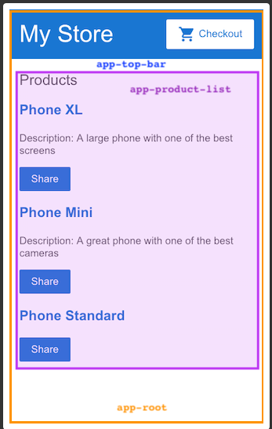

# Getting Start with angular

Este tutorial nos introduz ao essencial do Angular, nos guia na construção de um 
e-commerce, com catalogo, carrinho de compra é um check-out

## Take a tour of the exemple
Nos construímos aplicações angular com components. Componentes definem areas de
responsabilidades na interface permitindo o reuso de funcionalidades
Um component consiste em 3 coisas:

|Component part|Detail|
|--|--|
|A component class|trata dados e funcionalidades|
|HTML template|determina a UI|
|Component style|define a aparência|

O guia demonstra um app com os seguintes components

|Components|Details|
|--|--|
|\<app-root\>|Primeiro component a logar e é um container para os demais components|
|\<app-top-bar\>|Nome da Loja e botão de checkout|
|\<app-product-list\>|A lista de produtos|
|\<app-product-alerts\>|Um component que contem alertas da aplicação|

## Criar uma lista de produtos
Vamos fazer um update no projeto para que ele possa mostrar uma lista de produtos
Vamos usar uma lista de produtos ja predefinidos no arquivo products.ts

No projeto baixada ja esta tudo predefinido. No component tem um variável que 
recebe a list dos produtos e a partir dessa var __products__ vamos adicionar no
template a diretiva *ngFor para listar em div's os products
sintaxe do *ngFor:

~~~ html

    
{{product.name}}

~~~

Agora sera exibido uma lista de div's com os nomes dos produtos. Vamos organizar 
um pouco mais

~~~ html

    

        <h3>{{product.name}}</h3>
    

~~~

As chaves duplas {{}} é a forma com que o angular faz interpolação de dados do
component para o template

Para fazer cada nome do produto um link. Envolvemos nossa interpolação com a tag 
\<a> e podemos sett um titulo usando o propertyBinding []

~~~ html

    

        <h3> <a title="{{product.name}} details"> {{product.name}} </a></h3>
    

~~~

O title pode ser declarado de duas formas
titles ou [title]
a diferença é que com [] nos podemos ter acesso a property title em nosso component
e o dinamiza-lo como quisermos
O title pode ter seu dado dinamizado caso queiramos usando a interpolação. como
no exemplo acima

modo com o [] bracket notation
~~~ html

    

        <h3> <a [title]="product.name + 'details'"> {{product.name}} </a></h3>
    

~~~

Adicionaremos a descrição do produto. Usaremos a diretiva ngIf para criar o 
elemento apenas se existir descrição do produto. ngIf é uma diretiva que dependendo
de uma condição renderiza ou não o elemento que a implementa.

~~~ html

    

        <h3> <a [title]="product.name + 'details'"> {{product.name}} </a></h3>

        
 {{ product.description }} 

    

~~~

Adicionaremos um botão para o user pode compartilhar o produto. 
Vincularemos o evento de click do botão com um método do component. A syntaxe de um
bind de evento é o uso de parenteses _(**eventName**) = "**methodBinding()**"_

~~~ html

    

        <h3> <a [title]="product.name + 'details'"> {{product.name}} </a></h3>
        
 {{ product.description }} 

        <button type="button" (click)="share()">Share</button>
    

~~~

## Passar dados para um component filho
Proximo passo é criar um alerta que que usa os dados do produto vindo de 
ProductListComponent. O alerta de check do preço do produto notifica uma mensagem
se o produto tiver o preço acima de $700

Nesta sessão vamos criar um component children _ProductAlertsComponent_, que 
receberá dados vindo de seu component pai _ProductListComponent_

podemos gerar um novo component com o comando no bash:
~~~ bash
ng generate component product-alerts
~~~

O gerador do angular criará arquivos iniciais:
-   product-alerts.component.ts
-   product-alerts.component.html
-   product-alerts.component.css

Para receber dados do ProductListComponent, primeiro vamos importa o __input__ do
__@angular/core__

~~~ javascript
import {Component, Input} from '@angular/core';
import {ProductListComponent} from 'path';

~~~

No AlertsComponent vamos criar uma propriedade chamada product que terá essa o 
decorator @Input. Isso significa que essa propriedade irá receber dados de um 
component pai   

~~~ javascript
export class AlertsComponent {
    @Input() product!: Product;
}
~~~

No template de Alerts substituiremos os dados e adicionaremos uma tag p que so ira
renderizar se o produto estiver diferente de null e tbm se seu valor for acima de
700.

O Angular adicionou automaticamente o AlertsComponent no export do app-module o que
o torna possível de ser declarado em outro template. Então por fim basta
declarar o elemento do alerts no component pai, usando a tag com o nome do selector

~~~ html
<app-product-alerts [product]="product">
</app-product-alerts>
~~~

## Passar dados para um component Pai
Para fazer o button NotifyMe funcionar o component filho precisa passar dados para
o component pai. o ProductAlertsComponent precisa passar dados para 
ProductListComponent

Vamos primeiramente importa o Output e EventEmitter do _**@angular/core**_ 

~~~ javascript
import { Component,Input, Output, EventEmitter } from '@angular/core';

~~~
vamos definir no component alerts o field com decorator @Output e ele sera uma
instancia de EventEmitter que o nosso emissor de eventos
~~~ javascript
@Output() notify = new EventEmitter();
~~~

agora no template de alerts adicionamos um evento de click. E ao clicar chamaremos 
um método que lança um evento com uma mensagem de valor de event

~~~ html
p *ngIf="product.price && product.price > 700">
    <button type="button" (click)="notifyMe()">Notify Me</button>

~~~

~~~ javascript
export class ProductAlertsComponent {

  @Input() product!: Product;
  @Output() notify = new EventEmitter();

  notifyMe() {
    this.notify.emit('You will be notified when this product goes on sale!');
  }
}
~~~

No template de ProductListComponent adicionaremos o evento de __(notify)__ que
é o Output. No caso quando criamos um fiel com decorator Input, nos vamos passar
dados do pai com o '[]' e quando for Output, nos usamos o '()' que significa que
o evento sera emitido com um eventAction.

~~~ html
    

        <h3> <a title="{{product.name}} details"> {{ product.name }} </a></h3>
        
 {{ product.description }}

        <button type="button" (click)="share()">Share</button>
        <app-product-alerts [product]="product" (notify)="onNotify($event)"></app-product-alerts>
    

~~~

E criamos o método onNotify em ProductListComponent

~~~ javascript
    onNotify(event: string) {
        window.alert(event);
    }
~~~

Assim estará pronto.